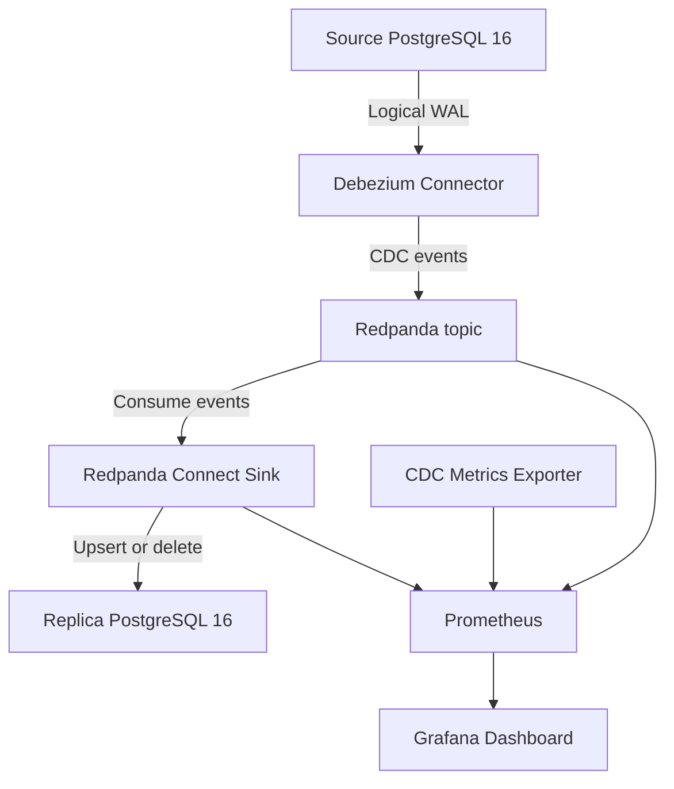

# PostgreSQL CDC Replication Pipeline

An end-to-end Change Data Capture (CDC) pipeline that continuously replicates row-level changes from a source PostgreSQL database to a replica PostgreSQL database.

The pipeline captures PostgreSQL WAL changes with Debezium, publishes them to Redpanda, applies them to the replica with Redpanda Connect, and exposes operational metrics through Prometheus and Grafana.

## Architecture



The first release intentionally replicates only `public.orders`, keeping the focus on correctness, recovery, and observability.

## Features

- Captures inserts, updates, and deletes directly from PostgreSQL WAL.
- Uses Redpanda as a Kafka-compatible event broker.
- Applies idempotent upserts and deletes to the replica database.
- Automatically configures Redpanda consumer-lag metrics.
- Automatically creates or updates the Debezium connector.
- Preserves data and connector offsets in Docker volumes.
- Exposes database, direct Debezium JMX, connector, replication-slot, lag, throughput, error, and latency metrics.
- Automatically provisions the Prometheus data source and Grafana dashboard.
- Includes PowerShell sustained-load and sink-recovery tests.
- Starts the complete stack with one Docker Compose command.

## Technology Stack

| Component | Technology | Purpose |
|---|---|---|
| Source database | PostgreSQL 16 | Stores the primary `orders` table and logical WAL |
| CDC capture | Debezium PostgreSQL Connector + JMX Exporter | Reads row changes from the WAL and exposes direct capture metrics |
| Event broker | Redpanda | Stores CDC events in `shop.public.orders` |
| Sink | Redpanda Connect | Applies events to the replica using upsert/delete queries |
| Replica database | PostgreSQL 16 | Maintains the synchronized copy |
| Custom exporter | Python + Prometheus client | Exposes database, Debezium, slot, row-count, and latency metrics |
| Metrics store | Prometheus | Scrapes and stores time-series metrics |
| Dashboard | Grafana | Displays pipeline health, lag, throughput, and latency |
| Orchestration | Docker Compose | Starts and connects all services |

## Project Structure

```text
postgres-cdc-pipeline/
|-- debezium/
|   |-- Dockerfile
|   |-- jmx-exporter.yml
|   `-- source-connector-config.json
|-- grafana/
|   |-- dashboards/
|   |   `-- cdc-monitoring-dashboard.json
|   `-- provisioning/
|       |-- dashboards/dashboard.yml
|       `-- datasources/prometheus.yml
|-- metrics/
|   |-- Dockerfile
|   |-- app.py
|   `-- requirements.txt
|-- prometheus/
|   `-- prometheus.yml
|-- replica-db/
|   |-- init.sql
|   `-- observability.sql
|-- scripts/
|   |-- load-test.ps1
|   `-- recovery-test.ps1
|-- sink/
|   `-- sink.yaml
|-- source-db/
|   |-- init.sql
|   `-- observability.sql
|-- docker-compose.yml
|-- .gitignore
`-- README.md
```

## Prerequisites

- Windows 10 or 11
- Docker Desktop with the Docker engine running
- PowerShell
- At least 4 GB of free RAM recommended for Docker

## Quick Start

Clone the repository, open PowerShell inside the project directory, and run:

```powershell
docker compose up -d --build
```

Docker Compose will:

1. Initialize both PostgreSQL databases.
2. Enable logical WAL on the source.
3. Start Redpanda and enable consumer-group lag metrics.
4. Build and start Debezium with direct JMX metrics, then automatically register the source connector.
5. Start the Redpanda Connect sink.
6. Start the custom CDC metrics exporter.
7. Start Prometheus and provision Grafana.

Check every service, including the one-shot initialization containers:

```powershell
docker compose ps -a
```

`redpanda-config` and `connector-init` should show `Exited (0)`. The remaining services should be running; PostgreSQL, Redpanda, and Debezium should be healthy.

## Service Endpoints

| Service | URL or port |
|---|---|
| Grafana | http://localhost:3000 |
| Prometheus | http://localhost:9090 |
| Debezium Connect API | http://localhost:8083 |
| Debezium JMX metrics | http://localhost:9404/metrics |
| CDC metrics | http://localhost:8000/metrics |
| Sink metrics | http://localhost:4195/metrics |
| Redpanda metrics | http://localhost:9644/public_metrics |
| Source PostgreSQL | `localhost:5433` |
| Replica PostgreSQL | `localhost:5434` |
| External Kafka API | `localhost:19092` |

Grafana development credentials:

```text
Username: admin
Password: admin
```

These credentials are intended only for local development.

## Verify the Connector

```powershell
curl.exe http://localhost:8083/connectors/orders-source-connector/status
```

The connector and its task should both report `RUNNING`.

## Test Live Replication

### Insert

```powershell
docker compose exec source-postgres psql -U postgres -d source_db -c "INSERT INTO orders (customer_name, amount, status) VALUES ('CDC Test', 2500, 'Pending') RETURNING *;"
```

Use the returned ID in the following commands. For example, if the ID is `3`:

```powershell
docker compose exec replica-postgres psql -U postgres -d replica_db -c "SELECT * FROM orders WHERE id = 3;"
```

### Update

```powershell
docker compose exec source-postgres psql -U postgres -d source_db -c "UPDATE orders SET status = 'Delivered' WHERE id = 3 RETURNING *;"
```

```powershell
docker compose exec replica-postgres psql -U postgres -d replica_db -c "SELECT id, customer_name, status FROM orders WHERE id = 3;"
```

### Delete

```powershell
docker compose exec source-postgres psql -U postgres -d source_db -c "DELETE FROM orders WHERE id = 3 RETURNING *;"
```

```powershell
docker compose exec replica-postgres psql -U postgres -d replica_db -c "SELECT * FROM orders WHERE id = 3;"
```

Allow a few seconds between a source write and its replica check.

## Run the Sustained Load Test

The included script inserts 1,000 rows in batches and waits until the replica catches up:

```powershell
powershell.exe -ExecutionPolicy Bypass -File .\scripts\load-test.ps1 -TotalRows 1000 -BatchSize 100 -DelayMilliseconds 500
```

A successful run ends with:

```text
CDC load test passed. Replica caught up with no row-count difference.
```

## Verify Data Consistency

Run the following query against both databases:

```powershell
docker compose exec source-postgres psql -U postgres -d source_db -c "SELECT COUNT(*) AS rows, MD5(STRING_AGG(CONCAT_WS('|', id, customer_name, amount, status, updated_at), ',' ORDER BY id)) AS checksum FROM orders;"
```

```powershell
docker compose exec replica-postgres psql -U postgres -d replica_db -c "SELECT COUNT(*) AS rows, MD5(STRING_AGG(CONCAT_WS('|', id, customer_name, amount, status, updated_at), ',' ORDER BY id)) AS checksum FROM orders;"
```

Matching row counts and checksums confirm that the replicated business data is identical.

## Test Sink Recovery

The recovery test stops the sink, writes an event while it is offline, restarts it, and verifies that the replica receives exactly one row with matching content:

```powershell
powershell.exe -ExecutionPolicy Bypass -File .\scripts\recovery-test.ps1 -TimeoutSeconds 120
```

The script also restarts the sink in its cleanup block if a test step fails. A successful run ends with:

```text
CDC recovery test passed: no event loss, no duplicate row, and matching content.
```

## Monitoring

Open Grafana at http://localhost:3000 and select:

```text
Dashboards > CDC > PostgreSQL CDC Pipeline
```

The provisioned dashboard includes:

- Redpanda and sink availability
- Input/output connection status
- Events received and written
- Sink errors and waiting events
- Consumer-group maximum and total lag
- CDC event processing rate
- Sink success percentage
- Source and replica database health
- Debezium connector and task status
- Direct Debezium events captured per second
- Direct Debezium lag behind the source
- Replication-slot presence and WAL lag
- Source/replica row-count difference
- End-to-end replication latency
- Topic message and byte throughput

The custom metrics endpoint exposes metrics such as:

```text
cdc_source_database_up
cdc_replica_database_up
cdc_debezium_connector_up
cdc_debezium_task_up
cdc_replication_slot_present
cdc_replication_slot_lag_bytes
cdc_source_orders_rows
cdc_replica_orders_rows
cdc_orders_row_count_difference
cdc_end_to_end_latency_seconds
```

Direct connector metrics are exposed by the Debezium JMX Exporter, including:

```text
debezium_metrics_TotalNumberOfEventsSeen
debezium_metrics_MilliSecondsBehindSource
debezium_metrics_NumberOfErroneousEvents
```

## Stop or Reset the Project

Stop containers while preserving all data:

```powershell
docker compose down
```

Restart later with the same persisted data:

```powershell
docker compose up -d --build
```

To perform a completely clean reset, the following command also deletes all project database, broker, Prometheus, and Grafana volumes:

```powershell
docker compose down -v
```

> Warning: `docker compose down -v` permanently deletes the local project data.

## Verified Results

This implementation has been practically verified with:

- Live insert, update, and delete replication.
- Sink stop/restart recovery without data loss or duplicate primary keys.
- Full Compose restart with persistent data and connector offsets.
- A clean installation using fresh Docker volumes and one startup command.
- A sustained 1,000-row load test that reached zero source/replica row-count difference.
- Exact equality after the load test: `1005` rows in each database with matching checksum `403e714748df75e7f7c27a50596e15cb`.
- Measured end-to-end latency of approximately `0.757 seconds` for a test event.
- Live Grafana panels for consumer lag, throughput, WAL lag, health, and end-to-end latency.

## Design Note

The original requirement describes Redpanda Connect running the Debezium PostgreSQL source directly. That native `postgres_cdc` input requires a Redpanda Enterprise or trial license. This project uses the open-source Debezium Connect runtime as a separate source-capture service, while Redpanda remains the Kafka-compatible broker and Redpanda Connect remains the PostgreSQL sink. The resulting CDC behaviour and monitored data path are equivalent, but the local stack contains additional containers.

## Current Scope

This phase deliberately does not include transformations, multiple sinks, alerting rules, chaos testing, or custom schema-evolution handling. Those are suitable follow-up improvements after the base pipeline.

## Author

**Abdul Ahad** — Data Engineering Project
